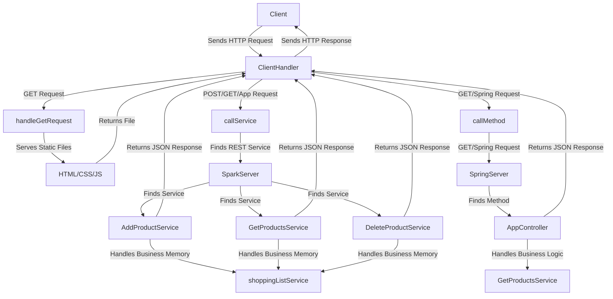

# TALLER DE ARQUITECTURAS DE SERVIDORES DE APLICACIONES, META PROTOCOLOS DE OBJETOS, PATRÓN IOC, REFLEXIÓN

## Introduccón

Este proyecto presenta un prototipo de servidor web en Java que cumple con los requisitos del taller de desarrollo de servidores web. El objetivo de este taller es construir un servidor web básico, similar a Apache, que sea capaz de entregar páginas HTML e imágenes en formato PNG. Además, el servidor incluye un framework de Inversión de Control (IoC) que permite construir aplicaciones web a partir de POJOs (Plain Old Java Objects).

## Descripción de la Aplicación

La aplicación desarrollada es un gestor de lista de productos pendientes por comprar. Permite a los usuarios añadir productos a una lista junto con una descripción detallada para facilitar la organización y el seguimiento durante las compras. La aplicación muestra cómo el servidor web puede manejar solicitudes para agregar productos, listar productos existentes y servir contenido estático como páginas HTML e imágenes PNG, simulando el uso del framework Spark y Spring Boot.

## Comenzando

Las siguientes instrucciones le permitirán obtener una copia del proyecto en funcionamiento en su máquina local para fines de desarrollo y prueba.

### Construido con:
    
* [Git](https://git-scm.com) - Control de versiones
* [Maven](https://maven.apache.org/download.cgi) -  Manejador de dependencias
* [java](https://www.oracle.com/java/technologies/downloads/#java22) - Lenguaje de programación

### Requisitos:

#### ⚠️ Importante

Es necesario tener instalado Git, Maven 3.9.9 y Java 22 para poder ejecutar el proyecto.

## Arquitectura de la Aplicación
El diagrama a continuación ilustra la arquitectura general de la aplicación, mostrando el flujo de solicitudes entre el cliente, el servidor, y los distintos servicios involucrados. La arquitectura sigue un patrón cliente-servidor con integración de servicios REST, Spring y Spark . A continuación, se describen los componentes y el flujo de datos:

## Diagrama de la Arquitectura

### Cliente Servidor

### Descripción del Diagrama:
1. **Cliente (Client)**
    - El cliente envía solicitudes HTTP al servidor mediante `ClientHandler`.

2. **Manejo de Archivos Estáticos**
    - Para solicitudes GET relacionadas con archivos estáticos (HTML, CSS, JS), `ClientHandler` dirige la solicitud a `handleGetRequest`.
    - `handleGetRequest` sirve los archivos estáticos desde el contenedor `HTML/CSS/JS`.
    - Los archivos estáticos se devuelven al cliente a través de `ClientHandler`.

3. **Manejo de Servicios REST**
    - Para solicitudes POST o GET dirigidas a servicios REST, `ClientHandler` llama a `callService`.
    - `callService` identifica el servicio REST adecuado a través de `SparkServer`.
    - `SparkServer` encuentra el servicio específico:
        - **`AddProductService`**: Maneja la lógica para agregar productos.
        - **`GetProductsService`**: Maneja la lógica para obtener productos.
        - **`DeleteProductService`**: Maneja la lógica para eliminar productos.
    - Cada servicio REST interactúa con `shoppingListService` para gestionar la memoria de los productos.
    - Los servicios REST devuelven una respuesta JSON a `ClientHandler`, que la envía de vuelta al cliente.

4. **Integración con Spring**
    - Para solicitudes GET que requieren la lógica de Spring, `ClientHandler` dirige la solicitud a `callMethod`.
    - `callMethod` envía la solicitud al `SpringServer`.
    - `SpringServer` localiza el método correspondiente en `AppController`.
    - `AppController` maneja la lógica de negocio específica, interactuando con `GetProductsService` para obtener la lista de productos.
    - La respuesta JSON es devuelta a `ClientHandler`, que la envía al cliente.

## Cómo comprender el funcionamiento de las funcionalidades requeridas

### Simulando Spring Boot

Esta parte de la aplicación permite hacer uso de solicitudes con `@GetMapping` y `@RequestParam` :
```bash
    @GetMapping(path = "/Spring/helloName")
    public static String helloName(@RequestParam(value = "name", defaultValue = "Luis Daniel Benavides Navarro") String name){
    return "Hola" + " " + name;
    }
  ```


Esta parte de la aplicación permite hacer uso de solicitudes con `@RequestMapping`:
```bash
    @RequestMapping(path = "/Spring/products", method = HttpMethod.GET)
    public static String products(){
        return GetProductsService.getAll();
    }
  ```


### Simulando Spark


## Instalación y ejecución 

Para instalar y ejecutar esta aplicación, sigue los siguientes pasos:

1. **Clonar el repositorio:**

   ```bash
   git clone https://github.com/AndresArias02/AREP-Taller3.git
   cd AREP-taller3
   ```

2. **Compilar y ejecutar:**

    ```bash
   mvn clean compile
   mvn exec:java '-Dexec.mainClass=edu.eci.arep.App'
   ```

3. **Abrir la aplicación en un navegador web:**

   Navega a http://localhost:8080/index.html para interactuar con la aplicación.

## Ejecutando las pruebas 

Para ejecutar las pruebas, ejecute el siguiente comando:


```bash
mvn test
```


## versionamiento 


## Autores

- Andrés Arias - [AndresArias02](https://github.com/AndresArias02)

## Licencia

[](https://opensource.org/licenses/MIT)

Este proyecto está bajo la Licencia (MIT) - ver el archivo [LICENSE](LICENSE.md) para ver más detalles.

## Agradecimientos 

- Al profesor [Luis Daniel Benavides Navarro](https://ldbn.is.escuelaing.edu.co) por compartir sus conocimientos.
    
